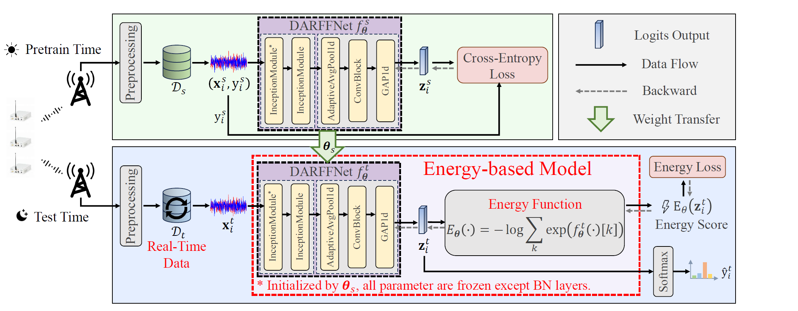
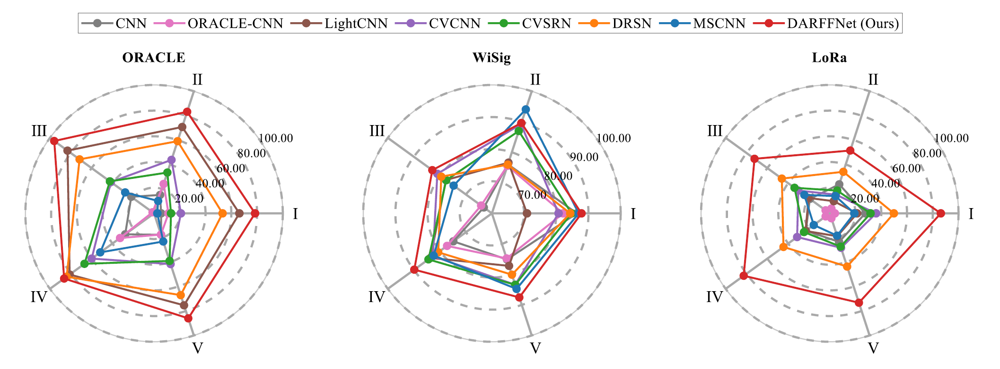
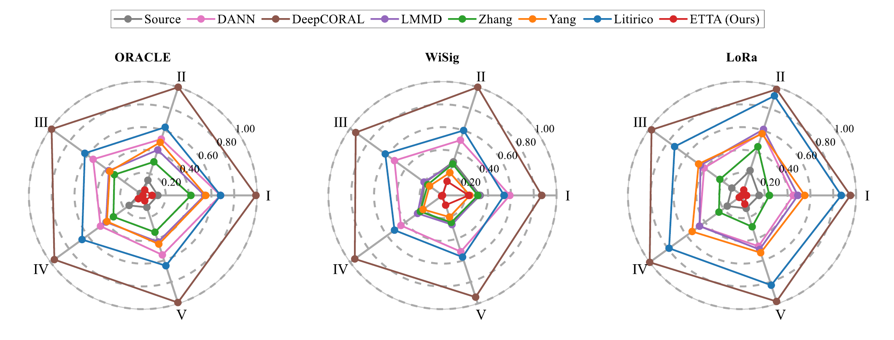
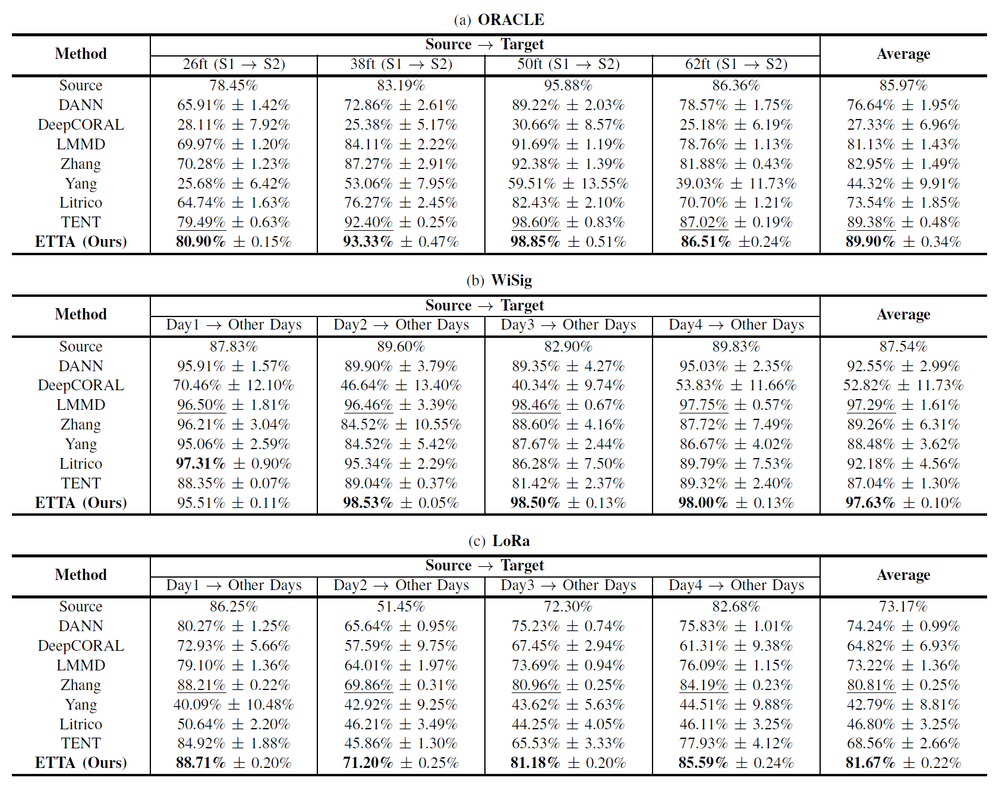

# Energy-Based TTA for Channel-Robust RFFI

## License / 许可证

This project is released under a custom non-commerical license, prohibiting its use for any commerical purposes.

本项目基于自定义非商业许可证发布，禁止用于任何形式的商业用途

## (TMC2026 Accept) Robust Radio Frequency Fingerprint Identification Under Temporal Domain Shifts via Energy-Based Test-Time Adaptation


Deep Learning (DL)-based radio frequency fingerprint (RFF) identification has garnered considerable attention as a reliable technology for physical layer device authentication, relying on neural networks trained on a large scale of labeled data. However, cross-domain generalization remains as a formidable challenge due to domain shifts caused by variations in channel and environmental conditions, with temporal domain shifts being especially prevalent. Many existing domain adaptation techniques heavily rely on access to the source data and suffer from a lack of real-time processing capabilities, making them inadequate for handling complex, dynamic, and non-cooperative electromagnetic environments. To address these challenges, we propose an Energy-Based Test-Time Adaptation (ETTA) framework that enables real-time domain adaptation under temporal domain shifts without access to source data and any label information. Specifically, we formulate the temporal domain shifts problem in RFF identification as an energy minimization-based continual TTA problem. The proposed ETTA method integrates energy-based modeling into RFF identification, using the energy score of test samples to guide the adaptation process. Meanwhile, we design a domain-adaptive RFF identification network (DARFFNet) that enhances the generalization capability across domain shifts. Experimental evaluations on three widely used radio frequency datasets demonstrate that our ETTA method significantly outperforms other comparative unsupervised domain adaptation (UDA) and source-free UDA (SFUDA) methods, achieving superior identification accuracy while maintaining computational efficiency. The results highlight the potential of energy-based adaptation in securing wireless communications against evolving domain shifts.


You can find more details in our [paper](https://ieeexplore.ieee.org/abstract/document/11617309): J. Zhang, T. Tang, Q. Wang, Y. Yin, T. Ohtsuki and G. Gui, "Robust Radio Frequency Fingerprint Identification Under Temporal Domain Shifts Via Energy-Based Test-Time Adaptation," in *IEEE Transactions on Mobile Computing*, doi: 10.1109/TMC.2026.3715839. 

## Directory Tree

```
ETTA-main 
├── config
├── data
├── model
├── result
├── util
│  	├── etta.py
│  	├── logger.py
|  	└── visualization.py
├── train_wifi.py
├── train_wisig.py
├── train_lora.py
├── adapt_wifi.py
├── adapt_wisig.py
└── adapt_lora.py
```

## Requirement

```
python 3.8.0
pytorch 2.4.1
pytorch-cuda 11.8
torchaudio 2.4.1
torchvision 0.20.0
```

## Dataset

```
The ORACLE dataset can be downloaded from this link: 
The WiSig dataset can be downloaded from this link: https://pan.baidu.com/s/1Ntj8f2xPbYeDS6DLhF7GqA?pwd=9sww
The LoRa dataset can be downloaded from this link: https://pan.baidu.com/s/1uhQZQ3pyeUxxnzkibIZglg?pwd=45f5
```

## How to run?

```
ORACLE Dataset:
python train_wifi -s 1 26
python adapt_wifi -sd 2025 -s 1 26 -t 2 26

WiSig Dataset:
python train_wisig -s 1
python adapt_wisig -sd 2025 -s 1 -t 2

LoRa Dataset:
python train_lora -s 1
python adapt_lora -sd 2025 -s 1 -t 2
```

## Experimental Results






